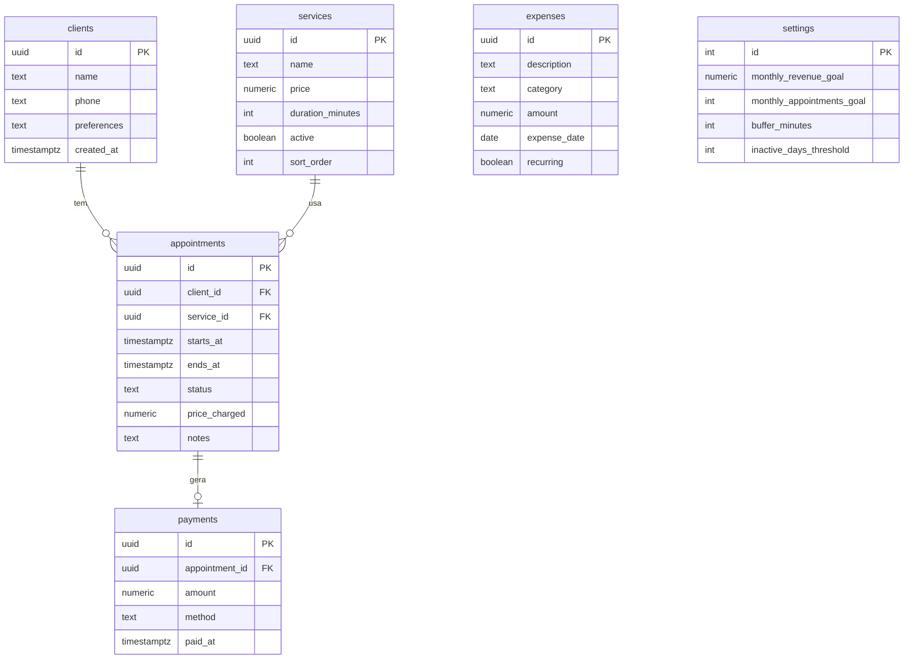

# Modelo de Dados (Supabase / PostgreSQL)

Rascunho para validar antes de criar as migrações.

## Diagrama

## Tabelas

- **clients:** nome, telefone (guardado só com dígitos, com DDI) e preferências. Sem e-mail nem senha.
- **services:** os 7 serviços atuais. Serviço usado em atendimentos antigos é **desativado**, nunca apagado, para preservar o histórico.
- **appointments:** `status` em `scheduled | completed | cancelled | no_show`. `price_charged` guarda o valor cobrado na hora, de modo que mudar o preço do serviço não altera o passado. `ends_at` = `starts_at` + duração do serviço.
- **payments:** um pagamento por atendimento concluído. `method` em `pix | cash | debit | credit`.
- **expenses:** despesas avulsas e recorrentes. `category` em `rent | mei | materials | other` (lista ajustável).
- **settings:** linha única com metas (R$ 3.600 e 30 atendimentos), intervalo entre atendimentos e dias para considerar uma cliente "sumida".

## Regras de integridade

- Dois atendimentos `scheduled` não podem se sobrepor (restrição de exclusão por intervalo de tempo) ou, no mínimo, validação na aplicação.
- Valores monetários em `numeric(10,2)`.
- Horários em `timestamptz`, exibidos em America/Sao_Paulo.

## Segurança (RLS)

- RLS habilitado em **todas** as tabelas.
- Política: apenas o usuário autenticado (a Gabriela) lê e escreve.
- A landing page lê apenas os serviços ativos, por uma view ou política restrita que expõe só nome, preço e duração.
- Nenhuma tabela com dados de clientes é legível sem login.

## Pendências

- Definir a lista final de categorias de despesa.
- Decidir se o intervalo entre atendimentos é fixo (`settings`) ou por serviço.
