# Modelo de Dados (Supabase / PostgreSQL)

As tabelas da Fase 2 (`settings`, `services`, `clients`, `appointments`) estão em [`supabase/migrations/`](../supabase/migrations/). As de pagamentos e despesas entram na Fase 3. **O banco só muda por migração**, nunca por cliques no painel do Supabase.

## Diagrama

```mermaid
erDiagram
    clients ||--o{ appointments : tem
    services ||--o{ appointments : usa
    appointments ||--o| payments : gera
    expenses
    settings

    clients {
        uuid id PK
        text name
        text phone
        date birth_date
        text preferences
        timestamptz created_at
    }
    services {
        uuid id PK
        text name
        text category
        numeric price
        int duration_minutes
        boolean duration_up_to
        boolean active
        int sort_order
    }
    appointments {
        uuid id PK
        uuid client_id FK
        uuid service_id FK
        timestamptz starts_at
        timestamptz ends_at
        timestamptz blocked_until
        text status
        numeric price_charged
        text notes
    }
    payments {
        uuid id PK
        uuid appointment_id FK
        numeric amount
        text method
        timestamptz paid_at
    }
    expenses {
        uuid id PK
        text description
        text category
        numeric amount
        date expense_date
        boolean recurring
    }
    settings {
        int id PK
        numeric monthly_revenue_goal
        int monthly_appointments_goal
        int buffer_minutes
        int inactive_days_threshold
    }
```

## Tabelas

- **clients:** nome, telefone (guardado só com dígitos, com DDI), data de nascimento (opcional, para aniversários e campanhas futuras) e preferências. Sem e-mail nem senha. Gasto total, serviço e horário favoritos **não são colunas**: são calculados dos atendimentos (`lib/client-stats.ts`).
- **services:** os 7 serviços atuais. `category` é o grupo da landing page ("Fibra e gel", "Tradicional"). `duration_up_to` indica duração máxima ("até 2 h"). Serviço usado em atendimentos antigos é **desativado**, nunca apagado, para preservar o histórico.
- **appointments:** `status` em `scheduled | completed | cancelled | no_show`. `price_charged` guarda o valor cobrado na hora, de modo que mudar o preço do serviço não altera o passado. Um gatilho (`appointments_fill`) preenche sozinho:
  - `ends_at` = `starts_at` + duração do serviço, se não for informado. Ao remarcar, mantém a duração; ao trocar o serviço, recalcula.
  - `blocked_until` = `ends_at` + intervalo das configurações.
  - `price_charged` = preço atual do serviço, se não for informado.
- **payments:** um pagamento por atendimento concluído. `method` em `pix | cash | debit | credit`.
- **expenses:** despesas avulsas e recorrentes. `category` em `rent | mei | materials | other` (lista ajustável).
- **settings:** linha única com metas (R$ 3.600 e 30 atendimentos), intervalo entre atendimentos e dias para considerar uma cliente "sumida".

## Regras de integridade

- **Conflito de horário barrado no banco:** dois atendimentos `scheduled` ou `completed` não podem ocupar o mesmo período de `starts_at` a `blocked_until` (restrição de exclusão `appointments_no_overlap`, erro `23P01`). Cancelados e faltas liberam o horário. A tela traduz o erro para uma mensagem amigável.
- Clientes e serviços com atendimentos não podem ser apagados (`on delete restrict`).
- Telefone guardado só com dígitos e DDI (12 ou 13 dígitos).
- Valores monetários em `numeric(10,2)`.
- Horários em `timestamptz`, exibidos em America/Sao_Paulo.

## Segurança (RLS)

- RLS habilitado em **todas** as tabelas.
- Política: qualquer usuário autenticado lê e escreve. Isso só é seguro porque **o cadastro público está desligado** no Supabase, e a única conta é a da Gabriela.
- A landing page (papel `anon`) lê apenas os serviços ativos. A tabela de serviços não tem dados sensíveis, então não precisa de view.
- Segunda camada: as permissões que o Supabase dá ao `anon` por padrão são retiradas (`revoke`). Mesmo com o RLS desligado por engano, clientes e agenda continuam fechados.

## Decisões

- **Intervalo entre atendimentos:** valor único em `settings`, 15 minutos, confirmado (2026-10-09).
- **Cliente "sumida":** 45 dias sem atendimento, ajustável em `settings`.

## Pendências

- Definir a lista final de categorias de despesa (Fase 3).
- Confirmar com a Gabriela os 45 dias para cliente "sumida".
